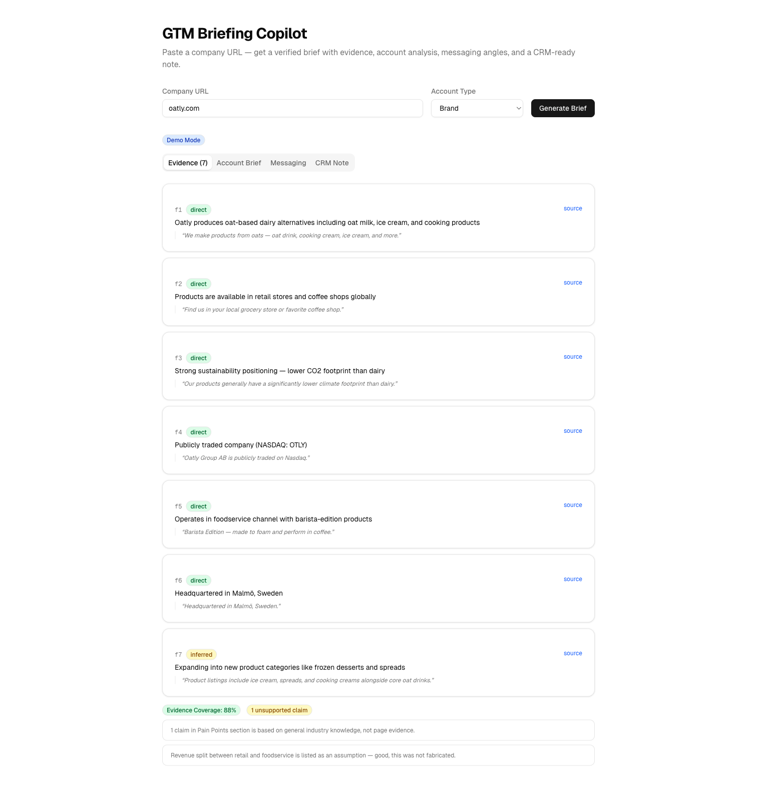

# GTM Briefing Copilot

Paste a company URL → get a verified GTM brief with evidence, account analysis, messaging angles, and a CRM-ready note in 30 seconds.

Built as an internal GTM tool — the kind of thing an AI Builder ships in their first week to accelerate sales and marketing workflows.



## How It Works

1. **Fetch** — Scrapes homepage + discovers internal pages by keyword matching links
2. **Extract Facts** — Claude Sonnet extracts structured facts with evidence grounding (`direct` / `inferred` / `missing`)
3. **Analyze** — Produces account brief tailored to account type (brand / distributor / operator)
4. **Generate Messaging** — 3 personalized messaging angles + CRM-ready note
5. **Verify** — Claude Haiku cross-checks all claims against extracted facts

Each stage streams results as they complete. No database, no auth — a stateless tool that does one thing well.

## Try It

**Demo mode** (cached results, instant): Enter `oatly.com` or `sysco.com`

**Live mode** (real pipeline): Enter any company URL

## Run Locally

```bash
git clone https://github.com/martin-minghetti/gtm-briefing-copilot.git
cd gtm-briefing-copilot
pnpm install
echo "ANTHROPIC_API_KEY=your-key-here" > .env.local
pnpm dev
```

Open [http://localhost:3000](http://localhost:3000).

## Architecture

```
URL + Account Type
  → Fetch (parallel: homepage + keyword-discovered pages)
  → Extract Facts (Sonnet) → structured JSON with evidence grounding
  → Analyze (Sonnet) → account brief with fact references
  → Messaging (Sonnet) → 3 angles + CRM note with fact references
  → Verify (Haiku) → evidence coverage, unsupported claims, contradictions
```

Sequential pipeline — not parallel agents. ICP and messaging depend on correct facts, so parallelizing reasoning would amplify hallucination. I/O is parallelized; reasoning is sequential.

See [DECISIONS.md](DECISIONS.md) for all architectural trade-offs.

## Tech Stack

| Layer | Technology |
|-------|-----------|
| AI | Claude Sonnet + Haiku via Vercel AI SDK |
| Frontend | Next.js 16, Tailwind v4, shadcn/ui |
| Scraping | cheerio |
| Validation | Zod (structured LLM outputs) |
| Deploy | Vercel |

## Cost Per Run

| Model | Calls | Estimated Cost |
|-------|-------|---------------|
| Claude Sonnet | 3 (extract + analyze + messaging) | ~$0.06-0.12 |
| Claude Haiku | 1 (verify) | ~$0.001 |
| **Total** | **4** | **~$0.06-0.12** |

## License

MIT
